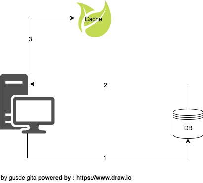

# Spring Cache #

Roadmap

* Overview Spring Cache
* Build from scratch
* Live Demo

## Cache in Spring ##

### Cache Abstraction ? ###

* Kumpulan duplikasi data yang disimpan pada suatu media
* Data original dari duplikasi memiliki akses yang mahal
    * waktu
    * resource processor
* Arsitektur sederhana



* Spring Framework telah menyediakan cara untuk melakukan cache pada Spring Application existing

`Goal : Improve the performance of your system`

### Enable Caching ###

* Simply adding the ```@EnableCaching```

### Caching With Annotations ###

* ```@Cacheable```
* ```@CachePut```
* ```@CacheEvict```
* ```@CacheConfig```

## Build dan Run ##

### Persiapan Database ###

* Buat database baru pada MySQL (misal : spring_cahce_demo)


### Spring Boot Initializr ###

1. Browse ke [https://start.spring.io/] (https://start.spring.io/)

2. Lengkapi Project Metadata

    Group
    
    ```
    com.sheringsession.balicamp.springcache    
    ```

    Artifact
    
    ```
    demo
    ```
   
    Dependencies
    
    ```
    Web, JPA, Cache, MySQL (Optional tergantung DB yang digunakan)
    ```
   
3. Generate Project

4. Download dan import pada IDE masing-masing


### Build with Maven ###

1. Pastikan `pom.xml` terdapat dependency berikut
    
    ```
    <dependencies>
		<dependency>
			<groupId>org.springframework.boot</groupId>
			<artifactId>spring-boot-starter-cache</artifactId>
		</dependency>
		<dependency>
			<groupId>org.springframework.boot</groupId>
			<artifactId>spring-boot-starter-data-jpa</artifactId>
		</dependency>
		<dependency>
			<groupId>org.springframework.boot</groupId>
			<artifactId>spring-boot-starter-web</artifactId>
		</dependency>
        <dependency>
            <groupId>mysql</groupId>
            <artifactId>mysql-connector-java</artifactId> 
			<scope>runtime</scope> 
        </dependency>
    </dependencies>
    ```

2. `applicatioin.properties` untuk konfigurasi database source, hibernate dll

    ```
    spring.datasource.url=jdbc:mysql://localhost/spring_cahce_demo
    spring.datasource.username=disesuaikan
    spring.datasource.password=disesuaikan
    spring.datasource.driver-class-name=com.mysql.jdbc.Driver
    
    spring.jpa.hibernate.ddl-auto=update
    spring.jpa.show-sql=true
    spring.jpa.properties.hibernate.format_sql=true
    
    spring.datasource.max-wait=40000
    spring.datasource.test-on-borrow=true
    spring.datasource.validation-query=SELECT 1
    
    spring.jackson.serialization.indent-output=true
    ```


### Build with your IDE ###

1. Buat Enity misal Product

    ```
    @SuppressWarnings("serial")
    @Data @Entity @Table
    public class Product implements Serializable{
        @Id @GeneratedValue(generator="uuid") @GenericGenerator(name="uuid", strategy= "uuid2")
        private String id;
        private String code;
        private String name;
        private BigDecimal amount;
        private Boolean outOfStock;
    }
    ```

2. Jalankan aplikasi

    ```
    mvn clean spring-boot:run
    ```
    Cek tabel Product otomatis akan terbentuk dalam database

3. Buat DAO `ProductDao` 

    ```
    public interface ProductDao extends PagingAndSortingRepository<Product, String>{
        public Product findByName(String name);
        public Product findByCode(String code);
    }
    ```

4. Buat Service `ProductService`

    ```
    public class ProductService {
        private static final Logger LOG = LoggerFactory.getLogger(ProductService.class);
        @Autowired private ProductDao productDao;
    
        public Product findProductByName(String name) {
            LOG.info("### Call service product by name {}", name);
            return productDao.findByName(name);
        }
        
        public Product findProductByCode(String code) {
            LOG.info("### Call service product by code {}", code);
            return productDao.findByCode(code);
        }
        
        public Product updateProduct(String id, String name) {
            LOG.info("### Call service put product id {}, name {}", id, name);
            Product p = productDao.findOne(id);
            p.setName(name);
            productDao.save(p);
            return p;
        }
        
        public void deleteProduct(String name) {
            LOG.info("### Call service evict product name {}", name);
        }
    }
    ```

4. Buat Controller `ProductController`

    ```
    @RestController @RequestMapping("/spring-cache/product")
    public class ProductController {
        private static final Logger LOG = LoggerFactory.getLogger(ProductController.class);
        @Autowired private ProductService productService;

        @GetMapping("/getByName/{name}")
        public Product getDataProductByName(@PathVariable String name) {
            LOG.info("## product controller getByName called here!!");
            return productService.findProductByName(name);
        }

        @GetMapping("/getByCode/{code}")
        public Product getDataProductByCode(@PathVariable String code) {
            LOG.info("## product controller getByCode called here!!");
            return productService.findProductByCode(code);
        }

        @GetMapping("/updateProduct/{id}/{name}")
        public Product updateDataProduct(@PathVariable String id, @PathVariable String name) {
            LOG.info("## product controller put product called here!!");
            return productService.updateProduct(id, name); 
        }

        @GetMapping("/deleteProduct/name/{name}")
        public String deleteDataProduct(@PathVariable String name) {
            LOG.info("## product controller delete product called here!!");
            productService.deleteProduct(name);
            return "Delete Product Cache berhasil !!!";
        }
    }
    ```
    
5. Jalankan menggunakan maven dan browse ke [http://localhost:8080/getByName/foo]

## GO TO LAB... ##

### Penggunaan @Cacheable ###

1. Tambahkan `@Cacheable(key = "#name")` pada salah satu method class ProductService

    ```
    @Cacheable("products")
	public Product findProductByName(String name) {
		LOG.info("### Call service product by name {}", name);
		return productDao.findByName(name);
	}
    ```
    
2. Tambahkan `@Cacheable(key = "#name", condition = "#name=='Product 002')` pada salah satu method class ProductService

    ```
    @Cacheable(key = "#name", condition = "#name=='Product 002'")
	public Product findProductByName(String name) {
		LOG.info("### Call service product by name {}", name);
		return productDao.findByName(name);
	}
    ```

3. Tambahkan `@Cacheable(key = "#name", unless = "#result.name=='Product p004')` pada salah satu method class ProductService

    ```
    @Cacheable(key = "#code"), unless = "#result.name=='Product p004'")
	public Product findProductByCode(String code) {
		LOG.info("### Call service product by code {}", code);
		return productDao.findByCode(code);
	}
    ```

### Penggunaan @CachePut ###

    ```
    @CachePut(key = "#name")
	public Product updateProduct(String id, String name) {
		LOG.info("### Call service put product id {}, name {}", id, name);
		Product p = productDao.findOne(id);
		p.setName(name);
		productDao.save(p);
		return p;
	}
    ```

### Penggunaan @CacheEvict ###

    ```
    @CacheEvict(key = "#name")
	public void deleteProduct(String name) {
		LOG.info("### Call service evict product name {}", name);
	}
    ```

### Penggunaan @CacheConfig ###

Before
    
    ```
    @Service
    @CacheConfig(cacheNames = "products")
    public class ProductService {
        ...
        ...
    }
    ```

After

    ```
    @Service
    @CacheConfig(cacheNames = "products")
    public class ProductService {
        ...
        ...
    }
    ```
    